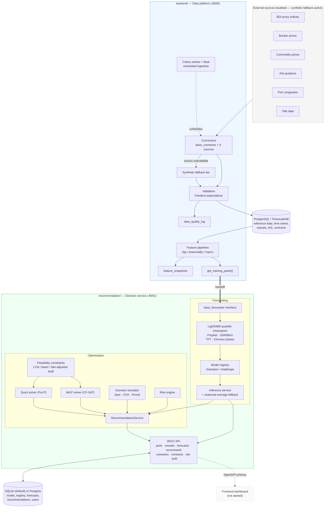
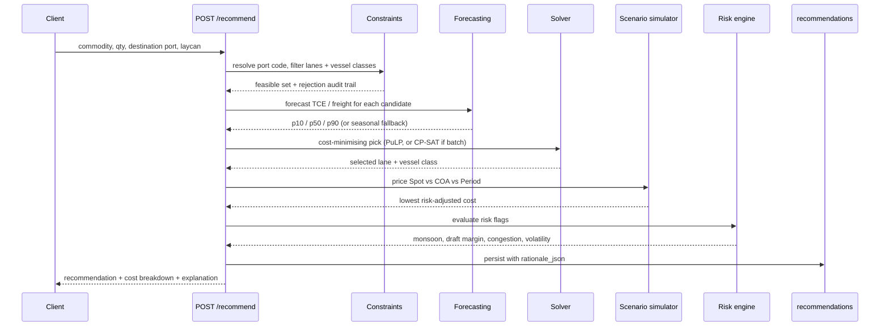
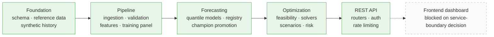

# Samundra Setu

Freight forecasting and chartering optimization for dry-bulk cargo movements into Indian east-coast ports.

Samundra Setu turns raw market and vessel data into a single explainable answer to the question *"which vessel class, on which lane, under which contract type, at what cost and what risk?"*

The repository contains two service trees:

| Tree | What it is | Runs on |
|---|---|---|
| `backend/` | **Data platform** — schema, reference data, ingestion connectors, validation, feature engineering, training panel | Docker (Postgres/TimescaleDB + Redis + Celery), port `8000` |
| `recommendation/` | **Decision service** — quantile forecasting, feasibility + solvers, scenario simulation, risk engine, REST API | Standalone (SQLite + synchronous tasks by default), port `8001` |

> **A note on filenames.** A few files on disk still carry the old stage-numbered names (`0002_phase2_...py`, `demo_phase3.py`, `tests/test_phase5_api.py`). Those are reproduced verbatim below so the paths stay copy-pasteable. Everything else is named by what it does.

---

## Architecture



### How a recommendation is produced



---

## Repository layout

### `backend/` — data platform

```text
freightiq/
├── docker-compose.yml        # postgres+timescaledb, redis, api, worker
├── .env.example
└── backend/
    ├── pyproject.toml
    ├── Dockerfile
    ├── alembic/
    │   └── versions/
    │       ├── 0001_init_schema.py
    │       └── 0002_phase2_data_quality_and_feature_snapshots.py
    ├── app/
    │   ├── config.py          # Pydantic Settings, env-driven
    │   ├── celery_app.py      # Celery app instance
    │   ├── db/
    │   │   ├── models.py      # SQLAlchemy ORM models
    │   │   └── session.py
    │   ├── schemas/
    │   │   ├── port.py
    │   │   ├── vessel.py
    │   │   ├── contract.py
    │   │   ├── forecast.py
    │   │   └── recommendation.py
    │   ├── ingestion/
    │   │   ├── exceptions.py        # source / validation exceptions
    │   │   ├── models.py            # data_quality_log
    │   │   ├── lookups.py           # cached foreign-key lookups
    │   │   ├── synthetic.py         # synthetic fallback tier
    │   │   ├── base_connector.py    # connector orchestration
    │   │   ├── connectors/
    │   │   │   ├── bdi_proxy_connector.py
    │   │   │   ├── bunker_price_connector.py
    │   │   │   ├── commodity_price_connector.py
    │   │   │   ├── ais_connector.py
    │   │   │   ├── port_congestion_connector.py
    │   │   │   └── tide_connector.py
    │   │   ├── validation/
    │   │   │   └── expectations.py  # Pandera schemas
    │   │   └── tasks.py             # Celery tasks + Beat schedule
    │   ├── features/
    │   │   ├── models.py
    │   │   ├── feature_store.py
    │   │   └── pipelines/
    │   │       ├── lag_features.py
    │   │       ├── seasonality_features.py
    │   │       ├── macro_features.py
    │   │       └── build_training_panel.py
    │   └── main.py            # FastAPI app, /health, /health/db
    ├── scripts/
    │   ├── seed_reference_data.py
    │   ├── synthetic_data_generator.py
    │   └── seed_synthetic_data.py
    └── seed_data/
        ├── vessel_classes.yaml
        ├── commodities.yaml
        ├── ports.yaml
        └── trade_lanes.yaml
```

### `recommendation/` — decision service

```text
recommendation/
├── pyproject.toml
├── requirements.txt
├── demo_phase3.py
├── app/
│   ├── config.py             # Settings incl. AUTH_ENABLED, rate limiting, MILP/idle params
│   ├── auth.py               # password hashing + JWT
│   ├── deps.py               # get_db / get_current_user / require_role
│   ├── main.py               # FastAPI app: routers, CORS, rate limiting, request logging
│   ├── worker.py             # Celery app: training / solver queues
│   ├── api/routers/
│   │   ├── auth.py            # POST /auth/token, GET /auth/me
│   │   ├── ports.py           # GET /ports, /ports/{id}, /ports/{id}/constraints
│   │   ├── vessels.py         # GET /vessels/classes, /vessels/trade-lanes
│   │   ├── forecasts.py       # GET /forecasts, POST /forecasts/models/train, ...
│   │   ├── recommendations.py # POST /recommend, /recommend/batch, /recommend/idle-mitigation
│   │   ├── scenarios.py       # POST /scenarios/compare
│   │   ├── contracts.py       # CRUD /contracts
│   │   └── risk.py            # GET /risk/{lane_id}
│   ├── db/
│   │   ├── models.py          # VesselClass, Port, TradeLane, ModelRegistry, Forecast,
│   │   │                      # Recommendation, User, CharterContract
│   │   └── session.py         # engine/session + init_db() seeding
│   ├── schemas/               # Pydantic request/response models per router
│   ├── features/              # training-panel access for this service
│   ├── forecasting/           # base_forecaster, registry, inference_service, training_job,
│   │                          # models/ (lightgbm_quantile, prophet, sarimax, tft, chronos)
│   └── optimization/          # constraints, quick_solver, milp_solver, scenario_simulator,
│                              # risk_engine, idle_mitigation, recommendation_service
├── scripts/verify_matrix.py
├── seed_data/
└── tests/
```

---

## Prerequisites

**Data platform (`backend/`)** — Docker, plus the Python project defined in `backend/pyproject.toml`. The stack is Postgres/TimescaleDB, Redis, the FastAPI API, and a Celery worker.

Two dependencies beyond the base project:

```text
numpy          # synthetic random-walk / seasonal generators
geoalchemy2    # WKTElement for writing ais_positions.location
```

`geoalchemy2` may already be present transitively via the PostGIS/`Port.location` setup — check before adding a duplicate pin.

**Decision service (`recommendation/`)** — Python 3 and `requirements.txt`. Nothing else. It runs standalone with no Docker stack.

---

## Quick start — data platform

```bash
# 1. Configure
cp .env.example .env

# 2. Start Postgres/TimescaleDB, Redis, API, worker
docker compose up -d

# 3. Apply migrations
docker compose exec api alembic upgrade head

# 4. Seed reference data (vessel classes, commodities, ports, trade lanes)
docker compose exec api python scripts/seed_reference_data.py

# 5. Seed five years of synthetic history
docker compose exec api python scripts/seed_synthetic_data.py --years-of-history 5

# 6. Verify
curl localhost:8000/health/db
```

Then enable ingestion task discovery — `backend/app/celery_app.py` must include the ingestion module:

```python
celery_app = Celery(
    "freightiq",
    broker=settings.celery_broker_url,
    backend=settings.celery_result_backend,
    include=["app.ingestion.tasks"],
)
```

If it currently reads `include=[]`, change it. `app/ingestion/tasks.py` registers its Beat schedule via `celery_app.conf.beat_schedule.update(...)` at import time, so the schedule activates as soon as the module is included. Nothing else in `celery_app.py` needs changing.

Run ingestion either synchronously (no broker required):

```bash
python -c "
from app.ingestion.tasks import run_all
print(run_all.run())
"
```

…or through Celery:

```bash
celery -A app.celery_app worker --loglevel=info &
celery -A app.celery_app beat --loglevel=info &
```

Finally, verify the training panel — the handoff point into forecasting:

```bash
python -c "
from datetime import date
from app.features.pipelines.build_training_panel import get_training_panel
df = get_training_panel(date.today())
print(df.shape)
print(sorted(df.columns))
"
```

A successful run prints the DataFrame shape and its sorted column names.

> Running the synchronous checks from outside the API container requires the project installed and `backend/` on the Python import path.

---

## Quick start — decision service

Defaults to SQLite and synchronous task execution, so it needs nothing from the Docker stack:

```bash
cd recommendation
python -m venv .venv && source .venv/bin/activate
pip install -r requirements.txt

uvicorn app.main:app --reload --port 8001
```

On startup `init_db()` creates tables, seeds vessel classes / ports / commodities / trade lanes, seeds baseline model-registry champions, and seeds the default user — so `/docs` is immediately usable with no separate seed step.

```bash
curl localhost:8001/health
curl localhost:8001/health/db
```

**To run against Postgres + Celery/Redis instead** (the production shape), set in `.env`:

```text
DATABASE_URL=postgresql://<user>:<pass>@<host>:5432/<db>
REDIS_URL=redis://<host>:6379/0
USE_CELERY=true
```

then run the API and a worker covering both queues:

```bash
uvicorn app.main:app --port 8001
celery -A app.worker.celery_app worker -Q training,solver --loglevel=info
```

### Tests

```bash
cd recommendation
PYTHONPATH=. pytest tests/ -q
```

`tests/test_phase5_api.py` exercises every router (auth, ports, vessels, scenarios, contracts, risk) plus `/docs` and the OpenAPI schema end-to-end against the seeded synthetic dataset.

---

## Configuration

Configure `.env` according to the settings expected by `app/config.py`. The ingestion connectors assume settings corresponding to:

```text
trading_economics_api_key
eia_api_key
aishub_api_key
marinetraffic_api_key
incois_api_key
use_synthetic_data
```

Exact variable names and aliases are determined by the project's `Settings` implementation; if the attribute casing or aliases differ, connector code needs adjusting.

### Synthetic mode

The ingestion layer is currently designed to exercise the **synthetic fallback path** end to end. Real source fetch and scrape methods are deliberately stubbed, so supplying API keys alone does **not** make those connectors live.

---

## Data platform detail

### Database initialization

`docker compose exec api alembic upgrade head` applies both migrations. The second one adds:

```text
data_quality_log
feature_snapshots
```

Its `down_revision` is expected to point at `0001_init_schema`. If the initial migration in the actual repository uses a different revision ID, the second migration must use that actual ID.

### Expected database state after seeding

These tables should be populated:

`vessel_classes` · `ports` · `trade_lanes` · `commodities` · the five time-series tables · `vessels` · `ais_positions` · `charter_contracts` · `voyage_simulations`

These three are **intentionally empty** — they hold model and engine outputs, not seed data, and zero counts here are not an error:

```text
model_registry     # trained / registered models
forecasts          # model-generated forecasts
recommendations    # optimization-engine output
```

Synthetic time-series rows are explicitly marked `data_provenance='synthetic'` so they are never presented with the same confidence as live data.

### The training panel contract

```python
from app.features.pipelines.build_training_panel import get_training_panel
```

This is the single interface the decision service consumes. Everything upstream of it — connectors, validation, quality logging, feature snapshots, lag/seasonality/macro pipelines — exists to produce it.

---

## Forecasting

Lives under `recommendation/app/forecasting/`.

- **`base_forecaster.py`** — the common `fit` / `predict` interface every model implements, so swapping LightGBM for Prophet, SARIMAX, TFT or Chronos is additive.
- **`models/`** — `lightgbm_quantile.py` (p10/p50/p90 quantile regression, the default champion), `prophet_model.py`, `sarimax_model.py`, plus `tft_model.py` and `chronos_model.py` stubs reserved for the deep-learning upgrade path.
- **`registry.py`** (`ModelRegistryManager`) — registers trained models against `model_registry` and promotes a challenger to active champion only if it beats the incumbent by `settings.DEFAULT_RETRAIN_MARGIN_PCT` (default 2%).
- **`training_job.py`** — `run_model_training_pipeline()`, invoked synchronously or via the Celery `training` queue (`app.worker.train_models_task`).
- **`inference_service.py`** (`ForecastingService.get_forecast`) — looks up the active champion for a `(trade_lane_id, vessel_class_id)` pair; if none exists it degrades gracefully to a naive seasonal rolling-average baseline rather than erroring, and persists every forecast with its feature snapshot to `forecasts` for auditability.
- **`backtest.py` / `audit.py`** — walk-forward validation and a `GET /forecasts/audit` coverage summary (training row counts, active champions, backtest metrics per lane × vessel class).

```bash
# Train
curl -X POST localhost:8001/api/forecasts/models/train \
  -H "Content-Type: application/json" \
  -d '{"trade_lane_ids": [1], "vessel_class_ids": [3], "target_variable": "TCE_rate"}'

# Forecast
curl "localhost:8001/api/forecasts?trade_lane_id=1&vessel_class_id=3&horizons=7&horizons=30&horizons=90"
```

If no model has been trained for a lane/class pair, `GET /forecasts` still returns a result, flagged with `model_fallback_used: true` and a `model_fallback_reason` explaining why.

---

## Optimization & recommendation

Lives under `recommendation/app/optimization/`.

- **`constraints.py`** — `resolve_port_code()` canonicalizes aliases (`"Paradip"` / `"INPRT"` → `"INPDP"`), and `filter_feasible_lanes_and_vessels()` produces a full candidate audit trail (considered / rejected-with-reason / feasible) against usable capacity and LOA, beam and tide-adjusted draft limits.
- **`quick_solver.py`** — synchronous single-cargo LP pick (PuLP), used by `POST /recommend`.
- **`milp_solver.py`** — OR-Tools CP-SAT multi-parcel formulation, used by `POST /recommend/batch` for larger parcel books or when `full_optimization=true`; runs on the Celery `solver` queue when `USE_CELERY=True`.
- **`scenario_simulator.py`** (`compare_charter_scenarios`) — prices Spot, short-term COA and Period charter side by side (freight, bunker, port dues, risk adjustment) and picks the lowest risk-adjusted cost.
- **`risk_engine.py`** (`evaluate_risk_flags`) — monsoon/cyclone seasonality, tide-adjusted draft margin, port congestion and demurrage, long-haul transit exposure, and forecast volatility.
- **`idle_mitigation.py`** — heuristic scorer for backhaul and open-cargo opportunities against an idle vessel.
- **`recommendation_service.py`** (`RecommendationService`) — orchestrates all of the above into one recommendation with a structured `rationale_json`, persisted to `recommendations`.

```bash
# Full recommendation
curl -X POST localhost:8001/api/recommend \
  -H "Content-Type: application/json" \
  -d '{
        "commodity": "coking_coal",
        "cargo_qty_mt": 75000,
        "destination_port_code": "INPRT",
        "laycan_start": "2026-10-01",
        "laycan_end": "2026-10-15"
      }'

# Compare Spot vs COA vs Period standalone — e.g. re-pricing a different
# quantity on a lane/class you already know
curl -X POST localhost:8001/api/scenarios/compare \
  -H "Content-Type: application/json" \
  -d '{"trade_lane_id": 1, "vessel_class_id": 3, "cargo_qty_mt": 60000}'

# Check risk flags for a lane before submitting a cargo request
curl "localhost:8001/api/risk/1?laycan_start=2026-07-15"
```

---

## API surface

Lives under `recommendation/app/api/routers/`, `app/auth.py` and `app/deps.py`.

| Router | Endpoints |
|---|---|
| `auth.py` | `POST /auth/token`, `GET /auth/me` |
| `ports.py` | `GET /ports`, `GET /ports/{id}`, `GET /ports/{id}/constraints` |
| `vessels.py` | `GET /vessels/classes`, `GET /vessels/classes/{id}`, `GET /vessels/trade-lanes` |
| `forecasts.py` | `GET /forecasts`, `POST /forecasts/models/train`, `GET /forecasts/jobs/{id}`, `GET /forecasts/models`, `GET /forecasts/audit` |
| `recommendations.py` | `POST /recommend`, `POST /recommend/batch`, `GET /recommend/batch/jobs/{id}`, `POST /recommend/idle-mitigation` |
| `scenarios.py` | `POST /scenarios/compare` |
| `contracts.py` | `GET /contracts`, `GET /contracts/{id}`, `POST /contracts`, `PATCH /contracts/{id}`, `DELETE /contracts/{id}` (soft-delete → `CANCELLED`) |
| `risk.py` | `GET /risk/{lane_id}` |

Interactive docs render at `/docs`; the raw schema is at `/api/openapi.json` for `openapi-typescript` client generation.

### Auth

Minimal single-role (`logistics_manager`) OAuth2 password flow plus JWT, gated behind `settings.AUTH_ENABLED` (**default `False`**) so local dev, CI and every read endpoint work unauthenticated out of the box. `User.role` is a free-text column rather than an enum, so multi-role RBAC (analyst / manager / admin) is additive later rather than a rewrite — `app/deps.py`'s `require_role(*roles)` dependency already exists for that.

A default account is seeded on first startup: `logistics_manager` / `changeme123` (`settings.DEFAULT_ADMIN_USERNAME` / `DEFAULT_ADMIN_PASSWORD`). **Rotate both before any non-local deployment.**

```bash
curl -X POST localhost:8001/api/auth/token \
  -H "Content-Type: application/x-www-form-urlencoded" \
  -d "username=logistics_manager&password=changeme123"

curl localhost:8001/api/auth/me -H "Authorization: Bearer <token>"
```

Setting `AUTH_ENABLED=true` plus a real `SECRET_KEY` makes mutating `/contracts` endpoints require a valid `logistics_manager` token; all `GET` endpoints stay open.

### Rate limiting & request logging

- `settings.RATE_LIMIT_ENABLED` (default `True`) applies a fixed-window limit (`settings.RATE_LIMIT_DEFAULT`, default `120/minute`) per client IP across every route via `slowapi` middleware — no per-route decorators needed.
- Every request is logged (method, path, status, duration) through a custom `app.middleware("http")` hook in `app/main.py`.

---

## Service-boundary note

`recommendation/` is its own FastAPI app, its own Celery app (`app/worker.py`), and its own `Base` / `DATABASE_URL` (defaulting to a local `freightiq.db` SQLite file) rather than a module bolted onto `backend/app`. Three consequences:

1. It runs and tests completely independently of `backend/` — nothing in it requires the Docker stack.
2. It does **not** share `backend/`'s Postgres database, ORM `Base`, or Alembic migrations. Its `init_db()` (in `app/db/session.py`) creates tables and seeds reference data directly via SQLAlchemy, with a schema-drift check that drops and recreates tables when seed data looks stale.
3. The plan called for a single OpenAPI schema for frontend client generation — there are currently **two**, one at `backend`'s `/api/openapi.json` and one at `recommendation`'s.

**This is the open decision blocking frontend work:** merge the two services into one deployable (matching the original modular-monolith framing), or keep them split and have the frontend consume two typed clients.

---

## Data provenance & modeling assumptions

### Provenance

- `seed_data/ports.yaml` carries a `source` field per port.
- Paradip and Visakhapatnam figures are citation-backed; other port figures are marked `source: estimated`.
- Those provenance notes are folded into each port's `notes` column.
- Trade-lane distances are placeholder approximations, not calculated sea routes. Proper sea-route calculation using the `searoute` package belongs to the ingestion layer, not the seed data.
- All synthetic time-series rows carry `data_provenance='synthetic'`.

### Assumptions worth knowing

**Declarative base.** `app/ingestion/models.py` and `app/features/models.py` try `from app.db.base import Base` and fall back to `from app.db.models import Base`. If the project's actual declarative base lives elsewhere, adjust those imports.

**BDI proxy lane mapping.** Composite indices (BCI/BPI/BSI/BHSI) are not lane-specific, but `freight_rates` requires a non-null `trade_lane_id`. The connector therefore broadcasts each index to every seeded lane for the matching vessel class and tags the source `trading_economics_proxy`. This is a modeling choice, not a schema requirement, and should be revisited once real data makes it misleading.

**AIS placeholder fleet.** The synthetic AIS fallback uses three hardcoded placeholder IMO numbers because the `vessels` table has no seeded roster. Replace with a query against `vessels` once a real roster exists.

**Two feature-snapshot concepts.** The `feature_snapshots` table is distinct from the `Forecast.feature_snapshot` JSONB column. They serve different purposes.

---

## Not implemented yet

1. Real API and scraper implementations for the connector stubs. `_fetch_*`, `_scrape_*` and `_parse_*` raise `NotImplementedError` by design; the acceptance path runs on synthetic fallback. Real clients can be wired into individual connector methods later without changing connector architecture.
2. Great Expectations — Pandera is used instead.
3. Frontend dashboard.

---

## Troubleshooting

**Celery doesn't discover ingestion tasks.** Confirm `include=["app.ingestion.tasks"]` is present in `backend/app/celery_app.py`.

**Migration fails on `0002_...`.** Check that its `down_revision` matches the actual initial migration revision ID.

**Real APIs produce no data.** Expected. The fetch/scrape/parse methods are stubs; ingestion runs on synthetic fallback.

**`model_registry`, `forecasts` and `recommendations` are empty after seeding.** Expected. They are populated by training and the optimization engine, not the seed scripts.

---

## Definition of done

### Data platform

- Docker services running.
- Alembic migrations reach `head`.
- Reference data seeded.
- Five years of synthetic history seeded.
- `/health/db` succeeds.
- Ingestion executes through `run_all.run()`.
- Celery worker and Beat discover and schedule ingestion tasks.
- Synthetic fallback ingestion completes end to end.
- `get_training_panel(date.today())` returns a DataFrame whose shape and columns can be inspected.

### Decision service

- `pip install -r requirements.txt` succeeds and `uvicorn app.main:app` starts with no Docker stack.
- `/health` and `/health/db` succeed.
- `/docs` renders and `/api/openapi.json` lists every router above.
- `POST /forecasts/models/train` + `GET /forecasts` return a forecast, with graceful fallback when no model is trained.
- `POST /recommend` returns a full recommendation (vessel class, contract type, cost breakdown, risk flags, rationale) for a sample cargo request.
- `POST /scenarios/compare` and `GET /risk/{lane_id}` work standalone.
- `/contracts` supports create / read / update / cancel.
- `POST /auth/token` issues a JWT for the seeded account; `AUTH_ENABLED=true` enforces it on mutating `/contracts` calls without blocking reads.
- `PYTHONPATH=. pytest tests/ -q` passes in full — 32 tests: 18 forecasting/optimization + 14 API.

---

## Roadmap



Everything through the REST API layer is complete. The frontend is the next piece of work, and it first needs the single-vs-split-service decision resolved.

---

## Command cheat sheet

### Data platform (`backend/`, port 8000)

```bash
cp .env.example .env
docker compose up -d
docker compose exec api alembic upgrade head
docker compose exec api python scripts/seed_reference_data.py
docker compose exec api python scripts/seed_synthetic_data.py --years-of-history 5
curl localhost:8000/health/db

# Ingestion, synchronous
python -c "from app.ingestion.tasks import run_all; print(run_all.run())"

# Ingestion, scheduled
celery -A app.celery_app worker --loglevel=info
celery -A app.celery_app beat --loglevel=info

# Training-panel check
python -c "
from datetime import date
from app.features.pipelines.build_training_panel import get_training_panel
df = get_training_panel(date.today())
print(df.shape); print(sorted(df.columns))
"
```

### Decision service (`recommendation/`, port 8001)

```bash
cd recommendation && pip install -r requirements.txt
uvicorn app.main:app --reload --port 8001

# Train
curl -X POST localhost:8001/api/forecasts/models/train \
  -H "Content-Type: application/json" \
  -d '{"trade_lane_ids": [1], "vessel_class_ids": [3]}'

# Forecast
curl "localhost:8001/api/forecasts?trade_lane_id=1&vessel_class_id=3"

# Recommend
curl -X POST localhost:8001/api/recommend -H "Content-Type: application/json" \
  -d '{"commodity":"coking_coal","cargo_qty_mt":75000,"destination_port_code":"INPRT","laycan_start":"2026-10-01","laycan_end":"2026-10-15"}'

# Log in (enforced once AUTH_ENABLED=true)
curl -X POST localhost:8001/api/auth/token -d "username=logistics_manager&password=changeme123"

# Tests
PYTHONPATH=. pytest tests/ -q
```
